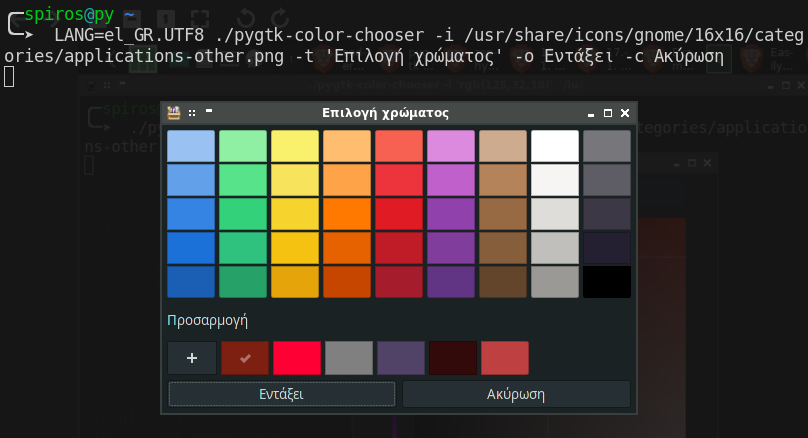
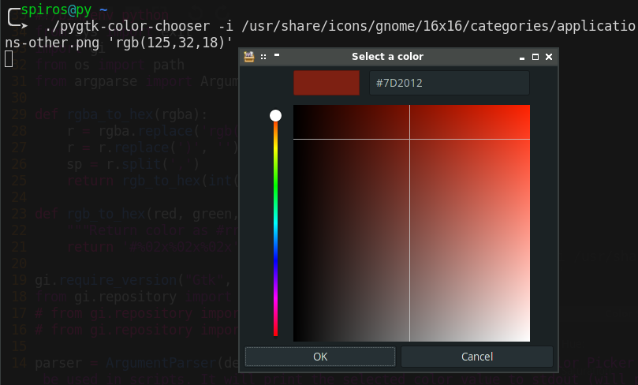
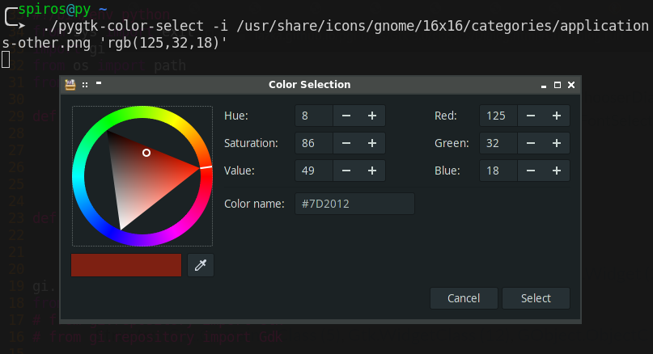

# PyGtk Color Selection Scripts

This repository contains two scripts to be used within a scripting project, to aquire a color value.

Both scripts
- require `python 3` and its `gobject` module to be installed.

- can accept a starting color value in HTML, RGB or RGBA format (#FF00FF, rgb(255,0,255) or rgba(255,0,255,1)).

- will ignore the transparency value of a RGBA color,

- can accept an icon (full path to the icon file - parameter **-i**).

- will print to `stdout` the value of the selected color in **HTML format** by default. RGB or RGBA output formats are also availabe (parameters **-r** and **-a**).

## 1. pygtk-color-chooser

The first script displays a Gtk color chooser window (no color picker available). Clicking the `+` button will open the `color editor`.

The window can be localized (using the **-t**, **-o** and **-c** command line parameters and the `LANG=xx_YY.UTF8` locale setting as shown in the image below).



When a starting color is passed to the script, the `color editor` will load automatically, as shown in the image below.



Finally, this is its help screen:

```
$ pygtk-color-chooser -h
usage: pygtk-color-chooser [-h] [-e] [-r] [-a] [-t TITLE] [-i ICON]
                           [-o OK_LABEL] [-c CANCEL_LABEL]
                           [color]

A Gtk Color Chooser to be used in scripts. It will print the selected color
value to stdout (will print nothing if Cancel is clicked) and terminate.

positional arguments:
  color                 Specify a default color. This can be in any of the
                        following formats: CSS name, HTML, RGB or RGBA. The
                        widget will automatically change to the color editor
                        view to display the color specified here. If the color
                        value is invalid, it will be ignored.

optional arguments:
  -h, --help            show this help message and exit
  -e, --editor          show the color editor only
  -r, --rgb             print color in rgb format instead of HTML
  -a, --rgba            print color in rgba format instead of HTML
  -t TITLE, --title TITLE
                        set window title
  -i ICON, --icon ICON  set window icon
  -o OK_LABEL, --ok-label OK_LABEL
                        set ok button label
  -c CANCEL_LABEL, --cancel-label CANCEL_LABEL
                        set cancel button label
```


## 2. pygtk-color-selector

The second  script displays a Gtk color selector window along with a color picker widget. This is basically the main difference between the two scripts.

Another less significant difference is that the window cannot be manually localized.

The window can be seen in the following image.



Finally, this is its help screen:

```
$ pygtk-color-selector -h
usage: pygtk-color-selector [-h] [-r] [-a] [-i ICON] [color]

A Gtk Color Selector with Color Picker to be used in scripts. It will print
the selected color value to stdout (will print nothing if Cancel is clicked)
and terminate.

positional arguments:
  color                 Specify a default color. This can be in any of the
                        following formats: CSS name, HTML, RGB or RGBA. If the
                        color value is invalid, it will be ignored.

optional arguments:
  -h, --help            show this help message and exit
  -r, --rgb             print color in rgb format instead of HTML
  -a, --rgba            print color in rgba format instead of HTML
  -i ICON, --icon ICON  set window icon
```
